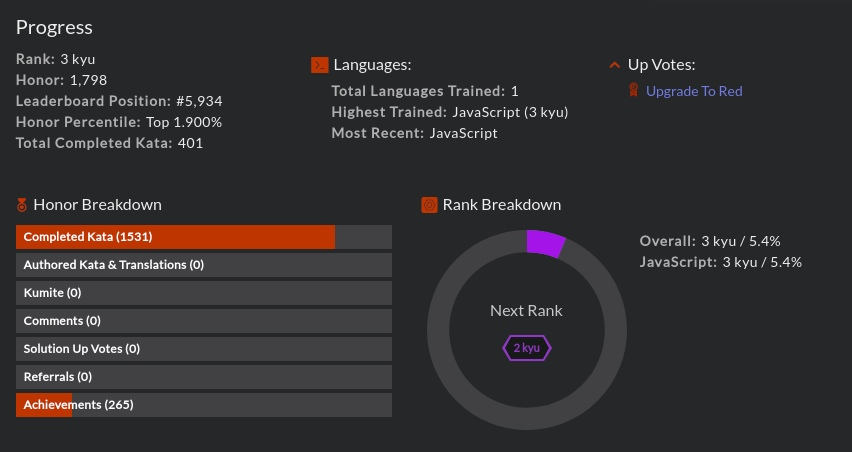

### This is my first commit!!!! 👋

# 💻🌎Hello world!!!🌎💻

Greetings and salutations! I'm Si, a full stack dev from Manchester, England🌧️☂️. I recently finished a coding bootcamp. I'm presently honing my skills - and looking forward to starting my first coding job in the near future! 43 years on planet Earth - it's time⌚!

## 🔧 Tech & tools I use to build stuff 🔧

                     

 
 

- 🔭 I’m currently working on - creating full-stack projects and finding a job
- 🌱 I’m currently learning - Vue, and working my darn hardest to deepen my knowledge of algorithms and data-structures
- ⚡ Fun fact: I share my birthday with Whoopi Goldberg!

 

## 📈 GitHub Stats 📈

 
 

## 📈 Codewars Stats 📈

<!--
**hyperkarmic/hyperkarmic** is a ✨ _special_ ✨ repository because its `README.md` (this file) appears on your GitHub profile.

Here are some ideas to get you started:

- 🔭 I’m currently working on ...
- 🌱 I’m currently learning ...
- 👯 I’m looking to collaborate on ...
- 🤔 I’m looking for help with ...
- 💬 Ask me about ...
- 📫 How to reach me: ...
- 😄 Pronouns: ...
- ⚡ Fun fact: ...
-->
